# Top 25 eCommerce Funding Platforms Ranked in 2025 (Latest Compilation)

**Running an online store and need a cash boost for inventory or marketing?** Traditional bank loans can be slow and require collateral, but **eCommerce funding** platforms offer a faster, flexible lifeline. These services provide **non-dilutive capital** tailored for online sellers – meaning you get funding without giving up equity, and repayment terms align with your sales. Below we’ve compiled the 25 best options to keep your **business cash flow** healthy and fuel your growth in 2025, whether you’re an Amazon FBA seller or a DTC brand scaling up.

## [8fig](https://www.8fig.co)
*Flexible funding up to $10M for Amazon & Shopify sellers’ supply chain needs.*

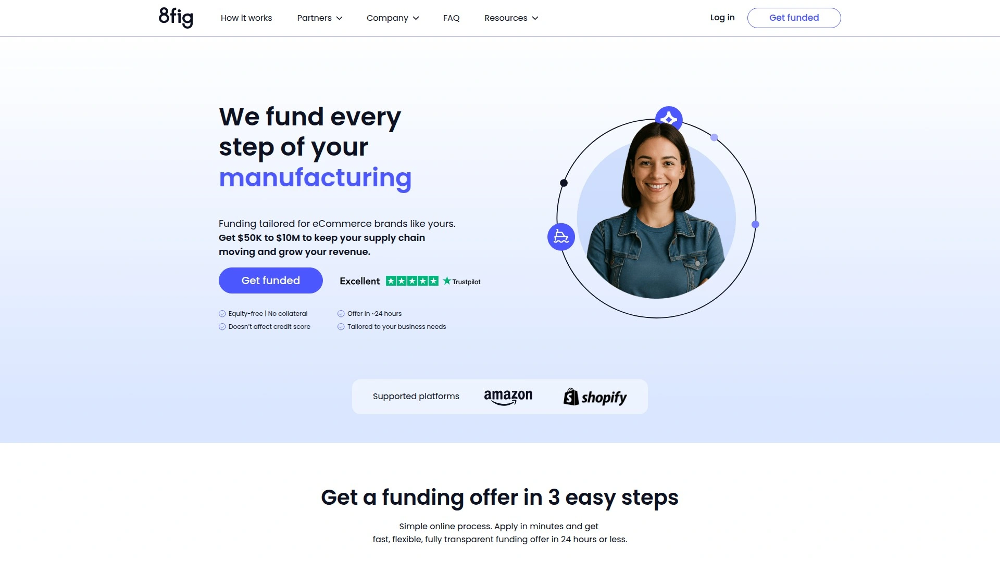

8fig specializes in **continuous capital for eCommerce supply chains**, ensuring you can pay suppliers and order inventory on time. Sellers connect their store and banking data, and 8fig’s platform uses AI to offer a personalized **“growth plan” funding within ~24 hours**. There are no credit score impacts or equity requirements – funding is based on your revenue trajectory. This makes 8fig ideal for growing merchants who need frequent cash injections to keep stock flowing and sales climbing, without the hurdles of traditional loans.

- **Fast & tailored:** Create a profile and apply in minutes; if approved, you receive a customized funding plan in under a day.
- **Founder-friendly terms:** No collateral needed and it won’t ding your credit. Repayments are aligned with your sales cycles, so you pay more when business is good and less during slow periods.
- **Use of funds:** Cover inventory purchases, marketing, shipping – 8fig funds every step of your **supply chain** to help you scale smoothly.

## [Clearco](https://clear.co)
*Data-driven funding up to $10M with no equity loss for online brands.*

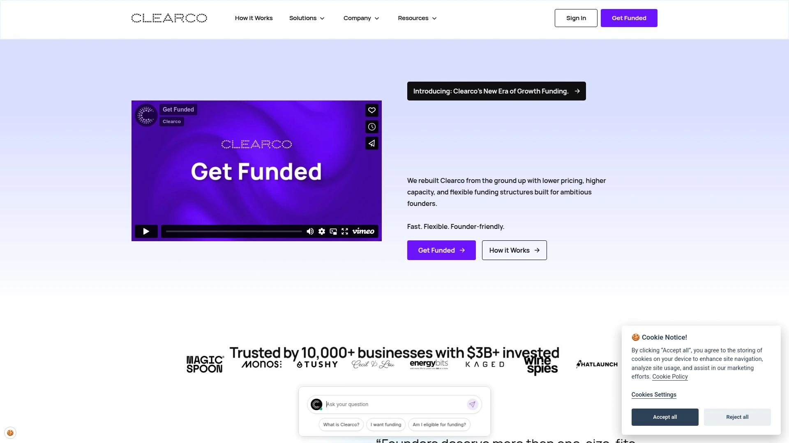

Clearco (formerly Clearbanc) is a pioneer of revenue-based financing, having invested over $3B in 10,000+ businesses. It provides **AI-driven funding offers** based on your ad performance and sales data. If you’re a scaling DTC brand or app, Clearco can advance capital in exchange for a share of future revenue until a fixed fee is repaid. The application is simple – connect your storefront and marketing accounts – and you can get an offer in as little as 24–48 hours.

Key highlights:
- **Non-dilutive capital:** Keep your ownership; Clearco charges a flat fee instead. No personal guarantees needed.
- **Multiple products:** Besides working capital for ads and inventory, they offer invoice factoring and even buy inventory to give you extended payment terms.
- **Global reach:** Available in North America and beyond, with a partner network to support founders (agencies, CFOs, etc.). Clearco’s scale and experience make it a go-to for established eCommerce players seeking big growth funds quickly.

## [Wayflyer](https://www.wayflyer.com)
*Revenue-based financing up to $20M for eCommerce growth, with lightning-fast offers.*

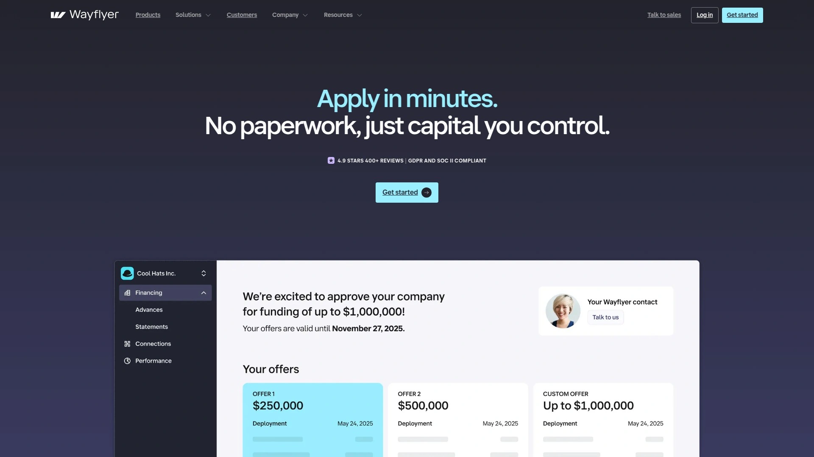

Wayflyer is an Irish-founded platform now serving brands worldwide with **working capital in exchange for a cut of revenues**. It’s known for large advance limits – from $10K to $20M – to fuel inventory purchases or marketing campaigns. Wayflyer connects to your store and ad accounts to assess performance. Qualified sellers (6+ months trading and $20k+ monthly revenue) can receive funds in hours.

- **Speed and simplicity:** Apply online in minutes; many get approved within a day. Repayment comes as a flexible percentage of daily sales, so during slower months you pay less.
- **Perks:** Wayflyer prides itself on **competitive rates** (they often highlight beating other offers) and provides analytics insights to help you optimize your spend.
- **Who it’s for:** Direct-to-consumer (DTC) brands, Amazon/eBay sellers, or any online merchant that needs a cash boost for growth but doesn’t want the hassle of banks. If you have consistent sales and need to scale inventory or ads, Wayflyer can be a reliable funding partner.

## [Onramp Funds](https://www.onrampfunds.com)
*Integrated financing (up to $2M) for sellers on Amazon, Walmart, Shopify and more.*

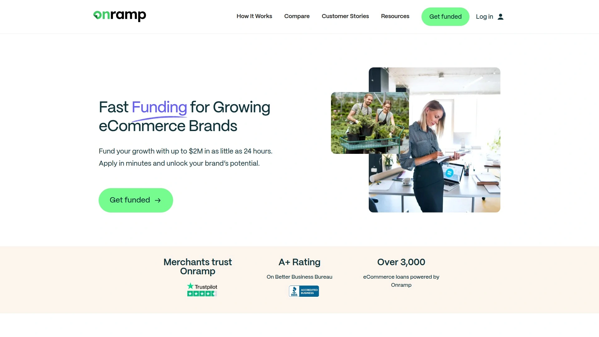

Onramp is built by eCommerce veterans to offer **fast, flexible working capital** to marketplace and DTC sellers. It plugs into your selling platforms – Amazon, Shopify, Walmart, eBay – to analyze real-time performance and provide funding offers accordingly. There’s no need for collateral; decisions come quickly (often 1-2 days).

- **Omnichannel support:** Whether you sell via your own online store or marketplaces, Onramp’s integrations mean they understand your business metrics. This makes it easier to get approved and funded based on actual sales, not just credit scores.
- **Use cases:** Pay for bulk inventory orders, invest in a new product line, or bridge cash gaps during peak season. Onramp’s capital can be used wherever your **eCommerce business** needs it.
- **Partner network:** Uniquely, Onramp has a network of eCommerce tool partners and agencies (for marketing, fulfillment, etc.). As a customer, you gain access to this ecosystem, which can further help optimize your operations alongside the funding.

## [SellersFunding (SellersFi)](https://sellersfi.com)
*All-in-one funding for online sellers – fast loans up to $1M plus daily marketplace payouts.*

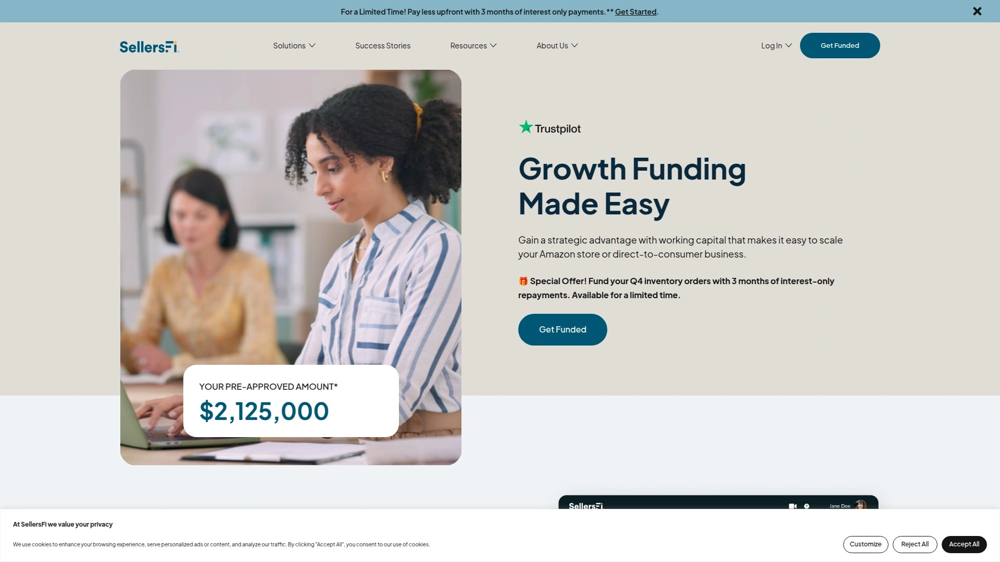

SellersFunding, now branded as SellersFi, focuses on the financial needs of marketplace sellers (Amazon, eBay, Walmart, etc.). They have deployed over **$1 billion to 30,000+ e-commerce sellers** since 2017. Their core offerings include:

- **Working Capital loans:** Borrow $5K to $1M for 3-24 month terms, often approved in 48 hours. There’s no impact on your credit when checking eligibility.
- **Daily Payouts:** Instead of waiting weeks for Amazon to pay, SellersFi’s Instant Pay can advance you ~80-90% of yesterday’s sales **the next day**, smoothing cash flow.
- **Global Seller Tools:** They also offer an International Wallet for collecting multi-currency sales and a prepaid card to use funds.

**Why it stands out:** SellersFi was built by understanding that online sellers often get rejected by banks. Their platform looks at your store data, not just credit, and provides funding tailored to eCommerce cycles (including seasonal variations). If you’re doing at least ~$20k/month in sales and need quick capital or daily cash flow, SellersFunding is a strong, specialized choice.

## [Uncapped](https://www.weareuncapped.com)
*Founder-friendly growth capital from $100K up to $5M in 24–48h, with flat fees.*

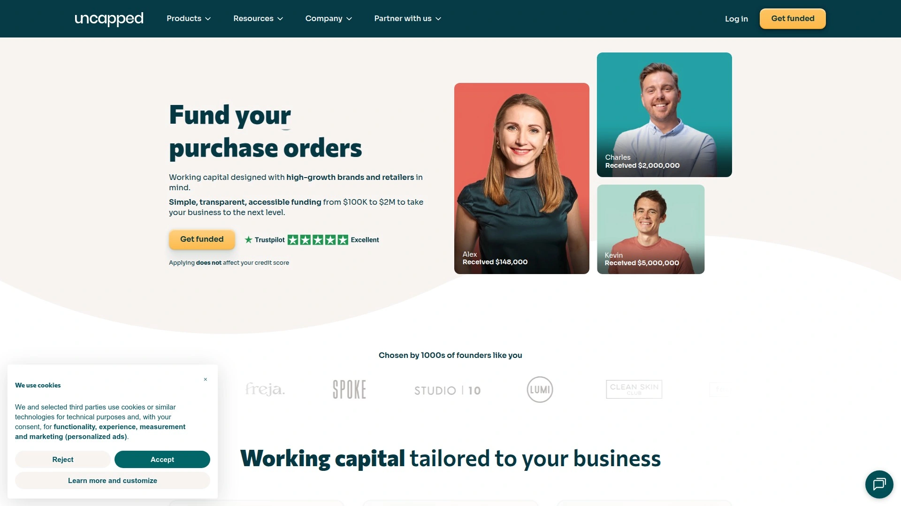

Uncapped is a UK-based fintech offering **non-dilutive financing** to online businesses in Europe and the US. It’s ideal for high-growth brands that need six or seven-figure infusions fast – for example, to stock up for a busy season or ramp up advertising. You can get between $100,000 and $2,000,000 in as little as two days (larger amounts available for very high revenue clients).

- **Simple pricing:** Rather than interest, Uncapped charges a flat fee on the capital provided. You know the full cost upfront and repay through a revenue share until that fixed fee is met. No hidden charges or compounding interest.
- **No equity, no personal guarantee:** As the name implies, there’s no cap on your potential – you don’t give up equity and aren’t risking personal assets. They won’t ask for personal guarantees or credit checks.
- **Tailored to you:** Uncapped has tiered options depending on your size. For instance, if you’re a smaller seller (~$10K monthly revenue), they have a starter program for Amazon sellers. Bigger brand doing $500K+ a month? They can set up a rolling line of credit. This personalization, along with a dedicated account manager, ensures the funding fits your business needs.

## [Settle](https://www.settle.com)
*Cash flow management via supplier payment financing – **buy now, pay later** for inventory.*

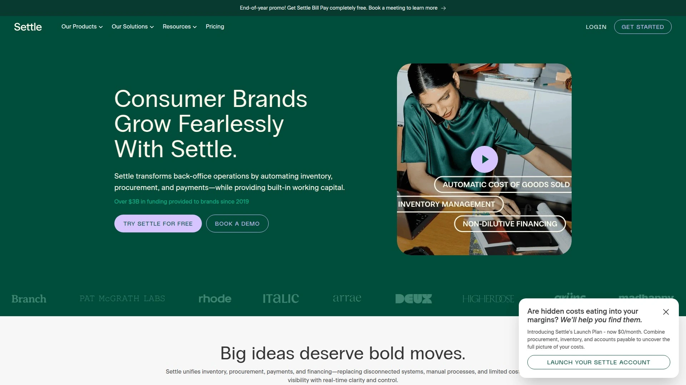

Settle takes a slightly different approach to eCommerce financing: it helps you **pay your suppliers upfront** and then gives you extended terms to repay Settle. In practice, you upload your vendor invoices to Settle – they’ll pay your supplier immediately, and you pay Settle back in 30, 60, or 120 days (your choice). It’s like getting supplier credit, even if your vendors demand cash on delivery.

- **Improve relationships & terms:** By paying suppliers quickly (with Settle’s money), you can often negotiate better pricing or secure stock that would otherwise require full prepayment. Settle’s service essentially **turns your payables into flexible financing**, boosting your purchasing power.
- **Easy bill management:** The platform also acts as a central hub for your outgoing payments. You can manage and schedule all vendor payments, so it doubles as a bookkeeping aid.
- **Great for growing DTC brands:** If you’re scaling and need a lot of inventory upfront, cash can get tight. Settle ensures you don’t miss out on big orders due to timing of cash flows. There’s a flat fee for the extended term, and you choose when to pay back within the agreed period – no hidden surprises.

## [Kickfurther](https://www.kickfurther.com)
*Inventory financing through a unique consignment crowdfunding model – pay as products sell.*

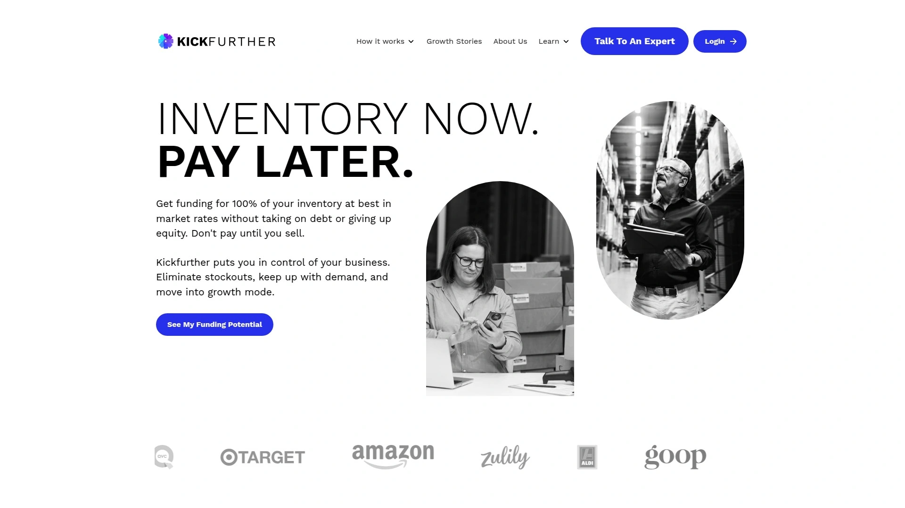

Kickfurther isn’t a typical lender; it’s a platform where a community of backers funds your inventory, and you repay them as that inventory sells. Essentially, **Kickfurther will purchase your inventory for you** and you buy it back over time (plus a fee) once you’ve sold it. This model can be a game-changer for physical product brands (especially CPG or retail goods) that need to stock up on more units but want to avoid traditional debt.

- **Crowd-powered capital:** You list a “Co-Op” on Kickfurther describing how much inventory you need and the profit margin you’ll share. Thousands of users can contribute to fund your purchase order, typically within a short window.
- **Flexible repayment:** Because it’s consignment, you generally only pay back as you move units. This aligns the financing with your sales velocity – **no large fixed monthly payments** when sales are slow. If your inventory sells faster, you pay the co-op back faster (and the funders earn their profit sooner).
- **Founder-friendly:** It’s non-dilutive (no equity taken) and often cheaper than high-interest loans. For many small brands, it’s also a way to build a community of backers who are literally invested in your success. Kickfurther works best for products with proven sales that need capital to scale up inventory for big retail or eCommerce demand spikes.

## [Payability](https://www.payability.com)
*Instant cash flow for marketplace sellers: daily payouts and advances up to $250K.*

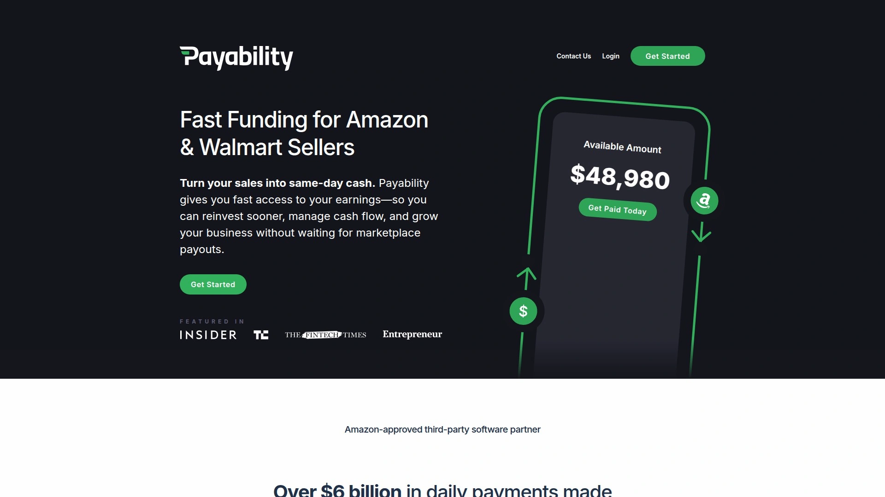

Payability offers two main financing products to **boost marketplace sellers’ cash flow**: **Instant Access** and **Instant Advance**. If you sell on Amazon, Shopify, Newegg, etc., Instant Access allows you to get paid **the next day for your sales** (instead of waiting weeks for the marketplace’s payment cycle). Typically, Payability advances you 80% of yesterday’s sales daily, and releases the remaining 20% when the platform’s payout comes through. This steady cash stream helps you reinvest in inventory or ads continuously.

Instant Advance, on the other hand, is like a merchant cash advance: a lump sum of up to around $250,000 based on your future sales, which you can get in as fast as 24 hours. It’s great for a larger investment need (e.g. buying holiday inventory in bulk) without waiting to accumulate revenue.

- **No credit checks:** Approval is based on your store’s health (sales history, account metrics) rather than personal credit. Payability is friendly to smaller sellers who have steady sales but little financing history.
- **Quick and convenient:** Setup is straightforward – link your marketplace accounts. Many Amazon sellers use Payability to solve the two-week payout delay **so they never run out of stock due to cash crunches**. The fees are transparent (a small percentage for daily advances, or a flat fee for lump sums).
- **Ideal for marketplace entrepreneurs:** If you rely on platforms with slow payouts (Amazon, Walmart, etc.), Payability essentially gives you a rolling advance so you can keep the growth momentum. It’s like getting paid in real-time for your online sales, which can be a huge competitive advantage.

## [Outfund](https://out.fund)
*UK’s largest RBF provider, now global – up to £10M to scale your subscription or eCom business.*

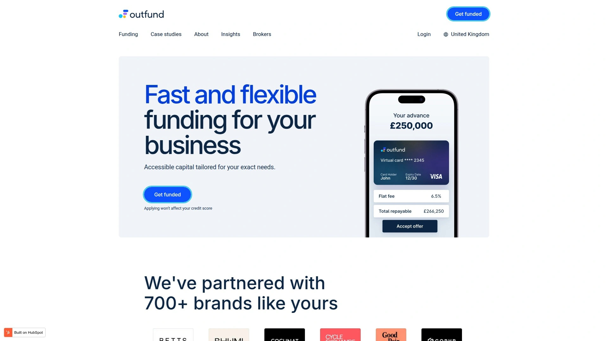

Outfund has emerged as a leading revenue-based financing company in Europe, with commitments to lend hundreds of millions to businesses annually. They fund eCommerce brands, SaaS, and even apps with a subscription model. If your company has at least 6 months trading and £25k+ monthly revenue, Outfund can be a strong partner. They provide **offers within 24 hours** thanks to automated data analysis, and you can draw anywhere from £10K to £10M of capital as needed.

- **Straightforward repayments:** You repay Outfund through a flexible percentage of your monthly revenue. Unlike fixed loans, if revenue dips one month, your payment shrinks accordingly – preserving cash when you need it.
- **Multi-country support:** They operate in the UK, Europe, U.S., and Australia, among others. This is useful if you’re expanding internationally; Outfund understands various markets and can continue funding as you grow cross-border.
- **No equity, no hassle:** Like others in this space, it’s non-dilutive and requires no personal guarantees. Outfund prides itself on being a faster, more flexible alternative to venture capital or bank loans for online entrepreneurs. It’s especially popular among subscription-based services and online retailers that have predictable revenues and want to fuel growth.

## [Yardline](https://yardline.com)
*Accelerator for marketplace sellers – fast capital up to $20M plus growth resources.*

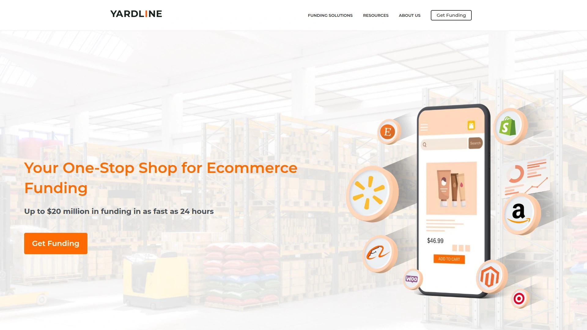

Yardline focuses on sellers in online marketplaces (Amazon, Etsy, Shopify stores, etc.), offering them quick funding to boost inventory, marketing, or expansion. Notably, Yardline can offer very large advances (even seven or eight figures) to power big growth moves. They tout providing **“fast, flexible funding”** in as little as 24 hours, which can be critical if you need to stock up for a holiday rush or jump on an opportunity.

- **Growth-centric approach:** Yardline was acquired by Thrasio (the big Amazon brand aggregator) early on, so they really understand the needs of FBA and marketplace businesses. Beyond funding, they offer advisory on how to optimize your business for profitability and eventual sale. It’s a bit like getting a growth partner alongside the money.
- **Flexible repayment:** They typically use a revenue share model (a portion of your sales) or a fixed plan depending on what makes sense for your situation. The idea is to not overburden you when sales are slower, similar to other RBFs.
- **Partner friendly:** Yardline has a partner directory and works with eCommerce service providers, which can benefit merchants via referrals to trusted tools or agencies. If you’re a marketplace seller aiming to level up quickly – maybe to become an attractive acquisition target or simply outpace competitors – Yardline’s hefty funding capability and industry know-how make it a top pick.

## [Viceversa](https://goviceversa.com)
*European funding platform for eCom, SaaS, and subscription businesses (up to €5M).*

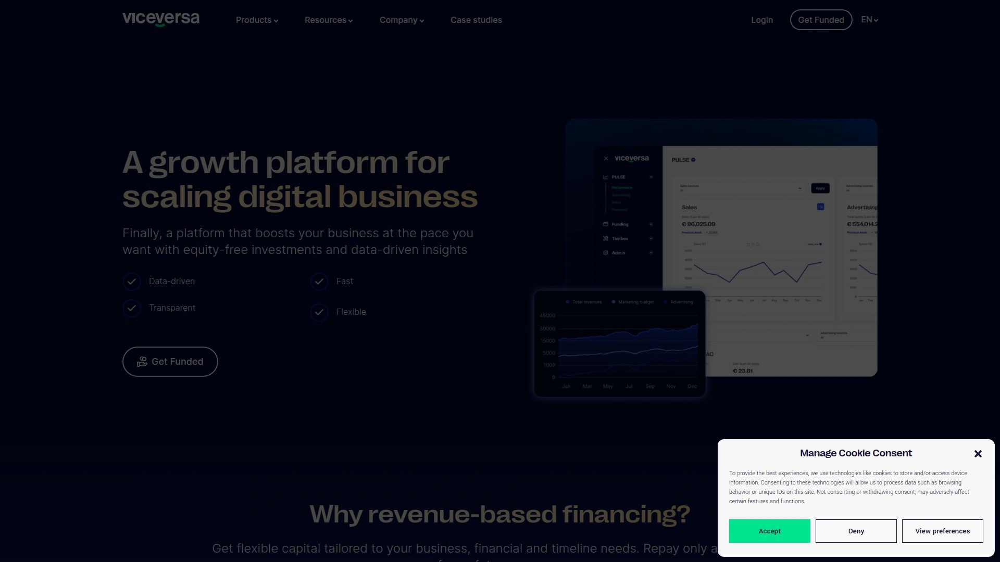

Viceversa is an Italy-based RBF platform that provides **growth capital for digital businesses across Europe**. Whether you run an online store, a SaaS, or even a mobile app with subscription revenue, Viceversa can help finance your growth initiatives. They typically fund amounts from €10K to €5M, which companies repay via a share of monthly revenue.

- **Marketing budget focus:** One unique eligibility criterion is having a marketing budget above €10k – Viceversa often positions its funding to be used specifically for customer acquisition (like fueling your Facebook/Google Ads). They invest in your marketing campaigns on the premise that increased spend will drive higher revenues to repay the advance.
- **Pan-European reach:** They work with businesses across EU countries. If you’re incorporated anywhere in Europe with 6+ months of online sales history, you can apply. This broad approach is great for EU startups that might not fit the criteria of UK or US-based funders.
- **Founders first:** Like others, no equity or guarantees required. Viceversa’s model aligns with your success – they grow when you grow. It’s a solid choice for European founders looking for a partner to scale marketing and subscriptions without giving up a stake in the company.

## [Ritmo](https://getritmo.com)
*Spain’s fast-growing eCommerce financier – up to €3M for inventory and ads, repaid as you earn.*

Ritmo is a Madrid-headquartered platform making waves in Europe with its quick funding for online sellers. It can advance between €5K and €3M to eligible businesses. The model: you receive capital to spend on growth (inventory, marketing, launching new markets), and Ritmo takes a percentage of your sales until a fixed amount is repaid. They highlight supporting **brands selling on Shopify, Amazon, and other online channels**, with a special focus on those investing heavily in marketing.

- **Tech-integrated:** Ritmo connects to your sales and ad platforms to analyze performance data (e.g., consistent monthly income of €10k+ over 6 months is a typical baseline). This means decisions are data-driven and fast.
- **Use of funds:** Many Spanish and Latin American eCommerce entrepreneurs use Ritmo to front-load marketing spend – essentially **turning ad spend into a revenue-share expense** rather than a sunk cost. If your ROI on ads is good, this can dramatically accelerate your growth without cash flow strain.
- **International expansion:** Ritmo has also expanded to Latin America, so it’s a good option if you operate in Spanish-speaking markets. With backing from major banks and firms, it’s one of the more robust players in the EU scene ensuring you have capital when you need it, and flexible repayments when you don’t.

## [Karmen](https://www.karmen.io)
*France’s revenue-based financing solution – up to €5M for SaaS and eCom, **fait sur mesure** (made to measure).*

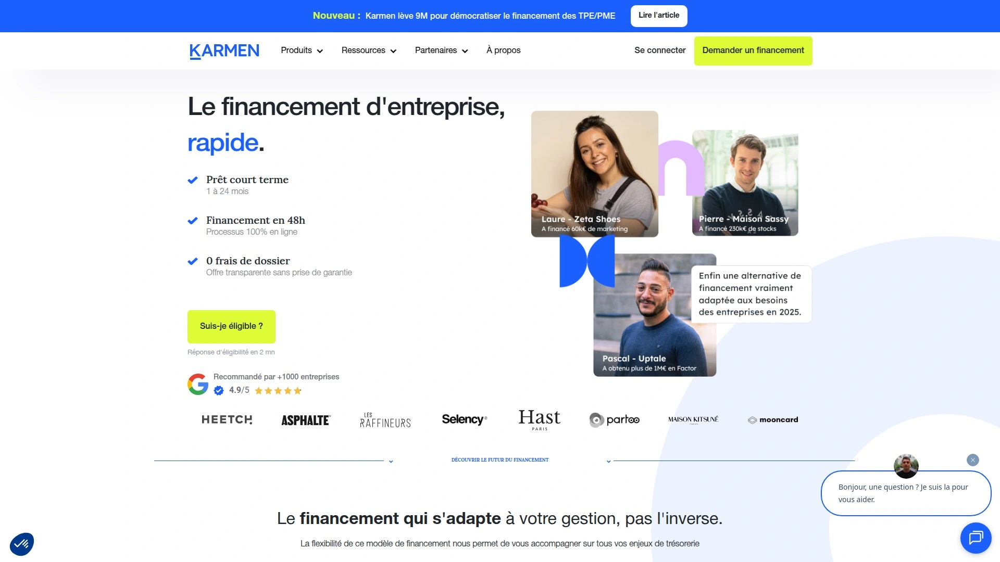

Karmen is a Paris-based fintech providing **non-dilutive funding to French online businesses**. If your startup or e-commerce company is based in France (or servicing the French market) and you have at least 9 months of revenue history, Karmen can be an attractive funding partner. They typically support financing needs up to €5 million, which covers a lot of ground from early-stage boosts to substantial growth capital.

- **Localized understanding:** Being focused on France, Karmen understands French business structures, banking, and market seasonality. This local expertise can mean more tailored terms and relevant support for your region (versus a generic global one-size-fits-all approach).
- **Broad use cases:** From accelerating subscription-based tech startups to helping an online retailer import more inventory, Karmen’s model applies. You get funds quickly and repay via a flexible plan tied to your revenue. Requirements include a healthy revenue run-rate (roughly €25k+ monthly), ensuring you can comfortably handle the repayments.
- **Fast and founder-friendly:** Applications are online and funding can come through in days, not months. You won’t be putting up personal collateral or shares. For French founders looking to scale without giving up capital or control, Karmen is a key player to consider.

## [Silvr](https://silvr.co)
*Non-dilutive financing in France & Germany – up to €10M with quick online approval.*

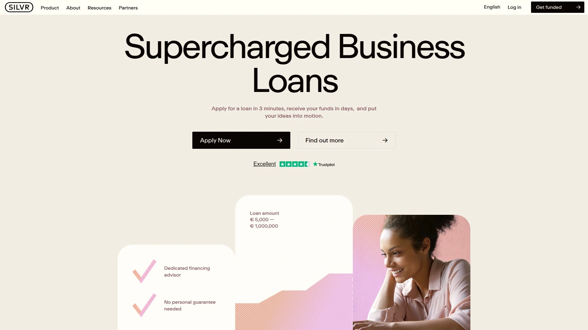

Silvr (yes, without an ‘e’) is another European RBF provider, focusing on **France and Germany** as primary markets. They fund e-commerce shops and SaaS businesses, offering anywhere from €10,000 to €10 million in capital. Silvr’s platform is fully digital: you connect your accounts, get a data-driven offer, and receive funds in as little as 48 hours if approved.

- **Fair criteria:** To qualify, a business should be operational at least 6 months and making €10k+ in monthly revenue. These criteria ensure you’re established enough, but they don’t demand profitability or a pristine credit score – growth trajectory matters more.
- **Products:** Silvr offers both revenue-based advances and more traditional term loans, giving some flexibility in how you structure repayment. But either way, no equity loss and no personal guarantee.
- **Growth insights:** An interesting perk – Silvr provides a dashboard with insights into your key metrics (CAC, LTV, etc.), gleaned from the accounts you connected. So it doubles as a bit of a **financial coach**. Overall, for companies in France or Germany seeking large-scale funds quickly, Silvr is a top choice, backed by a substantial funding capacity and local market focus.

## [Liberis](https://www.liberis.com)
*Embedded business funding – up to £1M for SMEs via partners (supports UK, US, and more).*

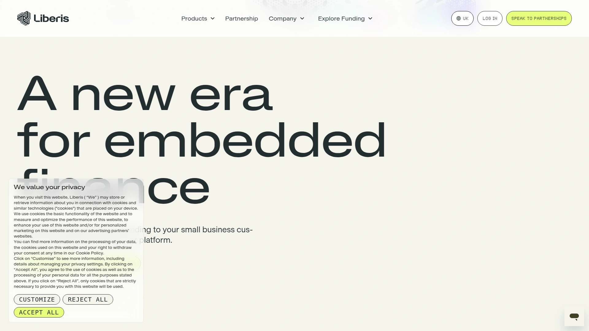

Liberis is a veteran in the financing space, originating from the UK and now offering **merchant cash advances** and funding via various platform partnerships. If you’ve ever seen offers for a cash advance inside your point-of-sale software or eCommerce platform, there’s a chance Liberis was powering it. They’ve funded over £500 million to small businesses. For eCommerce sellers, Liberis looks at your card sales or online revenue and can advance you up to £1M to grow your business.

- **Repayment via revenue cut:** True to MCA style, you repay by letting Liberis take a fixed percentage of your daily sales until the advance plus fee is repaid. This automatically adjusts to your revenue – pay more when you’re busy, less when things slow, **keeping stress off your cash flow**.
- **Easy access:** Liberis often integrates directly into platforms (for example, if you use Shopify or payment processors, you might get a pre-approved offer based on your transaction history). This makes obtaining funds seamless – sometimes just a few clicks, no lengthy forms.
- **Who it’s best for:** Small to mid-sized businesses that might not qualify for big bank loans but have steady sales. It’s available in multiple countries (UK, US, some EU), and because it’s embedded, it’s convenient. If you see an offer via Liberis in your dashboard, it’s worth considering for quick, flexible capital without complicated paperwork.

## [Uncapped (Unlimitd)](https://unlimitd.com)
*Quick funding up to €250K for European startups – flexible repayment aligned with revenue.*

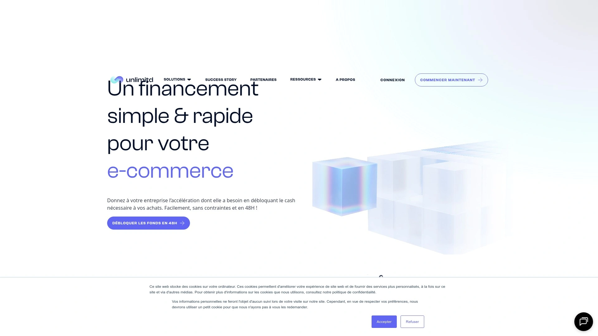

*(Not to be confused with the earlier Uncapped)* **Unlimitd** is a newer entrant, based in Europe, offering revenue-based financing for eCom, SaaS, and subscription businesses. They typically provide €10K to €250K in capital to growing companies. The model is similar: connect your accounts, get an offer, repay from a percentage of revenue. Unlimitd positions itself as a simple and founder-friendly way to get **small to mid-sized funding** without the red tape.

- **Ideal for smaller funding needs:** If you only need five or six figures of funding (not millions), Unlimitd is designed for that range. They can top up your cash for a new marketing campaign, a product launch, or bridge a short-term gap.
- **European focus:** Your business should be registered in Europe (EU/EEA/UK) and doing at least €10k per month in sales. The platform supports multiple currencies and markets in its assessment, which is great for EU startups operating across borders.
- **Transparent fees:** You’ll know upfront the total payback amount. Since it’s revenue-based, the time it takes to fully repay can vary, but there’s usually a cap (e.g., X months expected). No interest compounding, just a flat fee. For younger companies that want to avoid debt complexity, Unlimitd offers a straightforward cash boost to accelerate growth.

## [Paperstack](https://www.paperstack.ai)
*Data-driven funding (up to $5M) for Shopify and online retail brands in North America.*

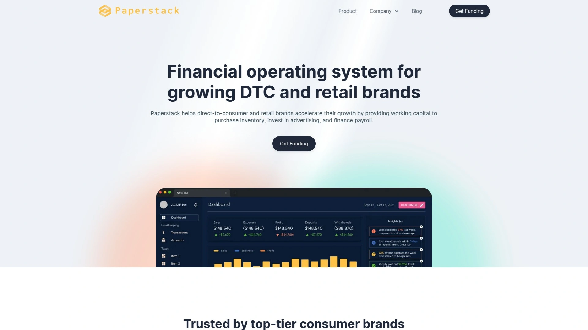

Paperstack is a financing platform focusing on **e-commerce and retail businesses in the US and Canada**. If your online store has at least $25k in monthly net revenue and a few months of track record, Paperstack can offer you an advance on future sales to invest in growth. It’s tailored for the Shopify generation of merchants who prefer quick, API-driven solutions over bank visits.

- **Smart analytics:** Paperstack plugs into your storefront (like Shopify) and possibly accounting tools to analyze your performance. They pride themselves on giving **higher funding limits** by understanding metrics like customer lifetime value and growth trends that traditional lenders miss.
- **Use cases:** Commonly, brands use Paperstack funding to bulk up inventory, launch new product lines, or scale ad campaigns when they see an opportunity. The funding amount grows as your store grows, creating a scalable partnership.
- **Fast and convenient:** You can get a term sheet in as little as 24 hours after connecting your data. Repayment is often a daily or weekly deduction from sales or your bank, making it painless and automatically proportional to your revenue. For Canadian and U.S. sellers who want a modern, tech-savvy funding partner, Paperstack is an excellent contender.

## [Ampla](https://getampla.com)
*Modern line of credit for DTC brands – revolving funds for inventory, marketing, and more.*

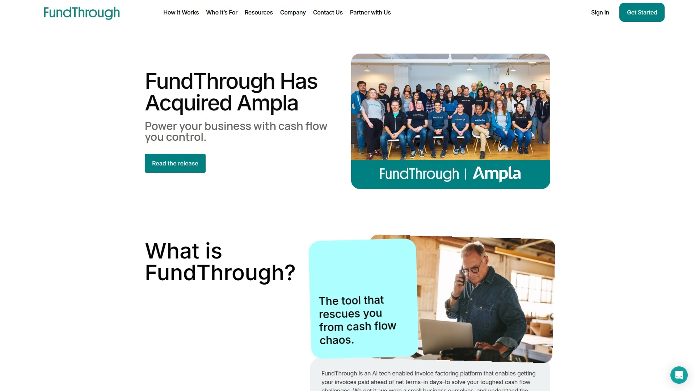

Ampla provides **revolving credit lines and loans** to consumer brands, acting as a financial umbrella for all your growth needs. Instead of a one-time advance that you repay via revenue share, Ampla often extends a line of credit which you can draw from, repay, and draw again. It’s like having a credit card for your business expenses but with a limit based on your revenue and receivables. They work with many **CPG and eCommerce companies** in beauty, food, apparel, etc.

- **Flexible usage:** You can use Ampla funds to pay suppliers, ad costs, 3PL bills – pretty much any expense to run and scale your brand. It integrates with your sales channels and bank to monitor performance.
- **Credit performance-based:** As you build trust by borrowing and repaying, Ampla can increase your limits. They advertise quick approvals (a few days) and competitive rates for those with solid sales.
- **Beyond funding:** Ampla positions itself as a “financial platform” – they even offer a cash management account and cards. This means along with borrowing, you get tools to manage your money in one place. For brands looking for a lasting financial partner to grow with (rather than ad-hoc advances), Ampla’s revolving credit solution is a strong option.

## [Booste](https://booste.com)
*Quick micro-funding (up to $25K) for small online stores, with a focus on CEE markets.*
Booste is a Poland-origin fintech providing **fast financing to emerging e-commerce sellers**, particularly in Central and Eastern Europe (though available in the UK and elsewhere). It offers relatively smaller funding amounts – typically up to $25,000 – which is perfect if you’re a newer or smaller-scale merchant who needs a few thousand to stock new inventory or tide through a cash dip.

- **Fast approval:** If you have at least 6 months of sales history, Booste’s algorithm can qualify you quickly. They aren’t looking for huge revenues; a consistent track record and growth potential count.
- **Repayment convenience:** Like others, you repay via a slice of your revenue or a short installment plan, making it easy and adapted to how your business performs.
- **Niche focus:** Booste has been popular among Shopify sellers, regional DTC brands, and even influencers launching product lines in countries like Poland, Spain, etc. It speaks your language (literally, their platform is localized) and understands the realities of those markets. If your funding needs are modest and you operate in Europe, Booste could be the boost you need without over-committing or getting stuck in red tape.

## [Choco Up](https://choco-up.com)
*“Grow Now, Pay Later” for Asia-Pacific eCommerce – flexible funding with value-added services.*

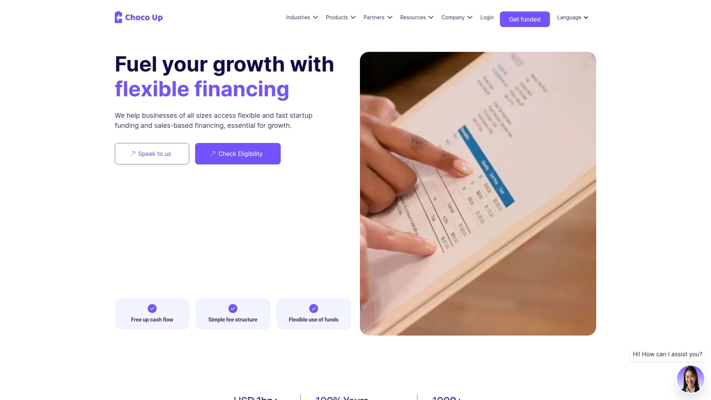

Choco Up is a leading growth funding platform based in Asia (Hong Kong & Singapore) that provides **revenue-based financing to e-commerce and SaaS companies across APAC**. They differentiate themselves by not only offering capital but also a network of partners and resources (payment solutions, marketing tools, etc.) to help businesses grow. Funding amounts range widely (they have a US$30M fund) and are tailored to each company’s metrics.

- **Fast & cross-border:** Choco Up can fund companies in various countries in Asia-Pacific, which is great if you’re in a region often under-served by Western financiers. Approval can be as quick as 48 hours after data integration.
- **Repayment model:** True to RBF, you repay via a percentage of monthly revenue until a predetermined amount is reached. This means you **“pay later” only as you see results from the growth funded by Choco Up’s capital**, keeping your risk low.
- **Additional perks:** Through partnerships, Choco Up clients get access to discounts and deals on services like payment processing, logistics, and more. It’s an ecosystem play – they want to be a one-stop growth partner. For any eCommerce or digital business in Asia seeking capital without diluting ownership, Choco Up is a top contender offering localized support and global expertise.

## [Klub](https://klubworks.com)
*India’s premier revenue-based financing platform – up to ₹30 Cr (≈$3.6M) for D2C and tech startups.*

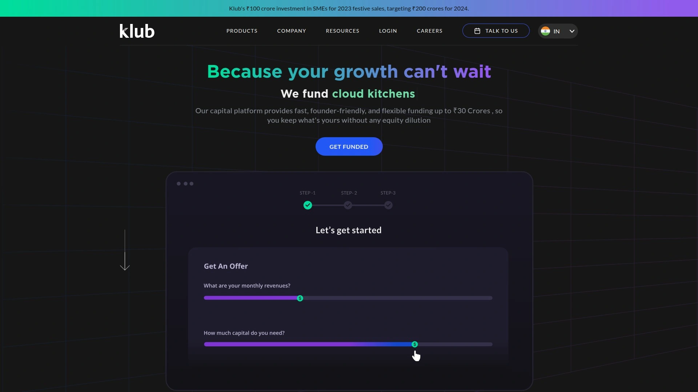

Klub is a frontrunner in **non-dilutive funding for India’s new-age companies**. From D2C brands to subscription apps, Klub provides growth capital that founders repay as a share of revenue. They have multiple funding plans based on your needs and scale – whether it’s a one-time boost or recurring capital every few months. By 2025, Klub has expanded beyond India to also cater to some Southeast Asian and Middle Eastern businesses.

- **Quick and digital:** You apply online, connect your sales and bank data, and get a term sheet often within a few days. Klub’s process is significantly faster than going through banks in India, which can be slow or demand collateral.
- **Founder-friendly terms:** No equity stake, no board seats – you keep control. Repayments flex with your revenue, so it never overburdens you. They usually expect businesses to have a certain scale (e.g., ₹10L+ monthly revenue) to qualify, ensuring you can comfortably repay.
- **Supporting growth:** Companies funded by Klub have used the money to do things like ramp up inventory before Diwali sales, launch new categories, or amplify digital marketing. Klub even **partners with incubators and VCs** to help startups extend their runway without additional equity dilution. For entrepreneurs in India’s booming startup scene, Klub offers a much-needed alternative to venture capital that’s fast, fair, and flexible.

## [Jenfi](https://jenfi.com)
*Fast, hassle-free financing for Southeast Asian online businesses (Singapore-based).*
Jenfi is a fintech startup out of Singapore that provides **revenue-based financing to digital businesses across Southeast Asia**. If you run an e-commerce store, online startup, or even a tech-enabled SME in SE Asia, Jenfi aims to get you growth capital in as little as a day. They’re backed by Y Combinator and have positioned their service as “Growth Capital as a Service.”

- **Tailored for digital SMBs:** Jenfi understands that many profitable online businesses in Asia still struggle with traditional banks. They look at your online sales, subscriptions, or other revenue to extend financing without requiring collateral.
- **Flexible funding use:** Whether it’s to scale ads, purchase inventory, or hire more sales staff, Jenfi’s funding comes with no strict usage covenants. You deploy it where your business needs it for growth, and repay via a revenue share.
- **Lightning-fast process:** Their claim to fame is a near-instant approval for qualified businesses – thanks to automation. **No long forms or branch visits**, everything is done through their site by connecting data sources. For startups in Singapore, Malaysia, Vietnam, etc. that need a quick cash infusion to capture a growth opportunity, Jenfi provides a modern, founder-friendly lifeline.

## [Fairplay](https://getfairplay.com)
*Latin America’s leading RBF for e-commerce – empowering merchants in Mexico and beyond.*

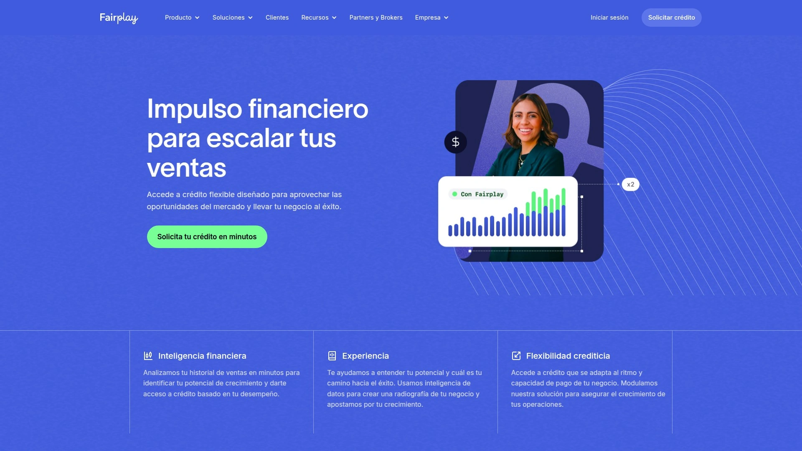

Fairplay is a Mexico-based platform providing **revenue-based financing to Latin American e-commerce businesses**. Often dubbed the “Clearbanc of LatAm”, Fairplay helps online sellers and startups unlock capital to invest in growth without taking on debt or giving up equity. They have secured substantial funding themselves, enabling them to lend aggressively in the region.

- **Growth marketing focus:** Fairplay often advances funds specifically to fuel performance marketing (Facebook/Google ads) and inventory for online stores. They invest in your growth campaigns, betting that increased marketing will drive the sales needed to repay the advance plus their fee.
- **Local market savvy:** The team understands local payment cycles, seasonality (like the importance of El Buen Fin in Mexico), and the challenges LatAm entrepreneurs face. This means more relevant risk assessments and terms for businesses operating in Latin America, compared to trying to work with a US or Europe-centric funder.
- **Rapid and scalable:** Qualified businesses can receive funds in days, and Fairplay can grow with you – their model allows for continuous top-up funding as your revenue rises. If you’re a Latin American seller looking for capital to scale, Fairplay offers a flexible, founder-friendly option to do so while keeping ownership intact.

## [Divibank](https://divibank.co)
*Brazilian financing platform for startups – turn future revenues into growth capital today.*

Divibank is a fintech from Brazil that provides **revenue-based financing to startups and SMEs**, enabling them to scale without venture capital. Since launching in 2020, Divibank has been helping companies finance digital marketing and inventory based on projected revenue streams. The model is straightforward: you get a cash infusion now and repay it with a percentage of future sales until a fixed return is met.

- **Empowering entrepreneurs:** In Brazil’s dynamic market, many great businesses are still under-served by banks. Divibank addresses this by looking at your real business metrics (online sales, ad performance) rather than just credit scores. If your campaigns generate revenue, they’ll fund you to amplify that.
- **Focus on marketing ROI:** Divibank often mentions funding for performance marketing – essentially giving you the budget to acquire customers now and pay back later from the sales those customers generate. It’s an appealing proposition for growing DTC brands and apps that can predict the revenue from ad spend.
- **Transparent and tech-driven:** Applications are online; decisions are relatively quick for the region (think days, not the weeks or months a bank loan can take). For Brazilian companies (and Latin America broadly) looking to harness alternative financing, Divibank stands out as a local, tech-savvy partner that speaks your language and understands your growth ambitions.

---

## **FAQ: Common Questions about eCommerce Funding Platforms**

**Q1: Do these eCommerce funding platforms require me to give up equity or personal collateral?**
**A1:** No – the beauty of these platforms is that they offer *non-dilutive* capital. You’re not giving away shares in your business, and typically no personal guarantees are needed. Approval and repayment are based on your business’s revenue performance, not your personal assets or credit score.

**Q2: How fast can I get funding for my online business?**
**A2:** It’s much quicker than traditional financing. Many providers can approve and fund within 1-3 days once you connect your data. For instance, **8fig** often gives a funding offer in ~24 hours, and others like Wayflyer or Clearco aren’t far behind. This means you can seize time-sensitive opportunities (a flash sale, a bulk inventory buy) without waiting weeks for a loan.

**Q3: Which funding platform is best for a new or small seller?**
**A3:** It depends on your revenue size and needs. If you’re relatively small (say under $20K monthly sales), options like **Payability** (for daily payouts) or **Booste** (micro-funding up to $25K) are tailored for you. As you grow into mid-size, platforms like **8fig** or **Onramp Funds** can scale funding into the millions to support your expansion. Always check each provider’s minimum requirements – some have revenue thresholds to qualify.

---

## **Conclusion & Next Steps**

Navigating the fast-paced world of online selling is a lot easier when your growth isn’t held back by cash flow. The **top 25 eCommerce funding platforms** above ensure you can keep investing in inventory, marketing, and expansion exactly when you need to. By leveraging data from your store and offering flexible, founder-friendly terms, they take the pain out of financing for digital entrepreneurs. Remember, the *best* choice comes down to your specific situation – consider factors like how quickly you need funds, repayment preferences, and regional availability.

That said, **our #1 pick [8fig](https://www.8fig.co)** stands out for a reason: it’s superb for scaling Amazon/Shopify sellers who need continuous capital to keep their supply chain moving. 8fig’s tailored growth plans and speedy funding can be a game-changer if you’re juggling big inventory orders and rapid growth. Ultimately, with the right funding partner in your corner, you can focus on what you do best – building your brand – while they fuel your journey to new eCommerce heights. Here’s to your business hitting that next figurative (or literal) 8-figure milestone!
